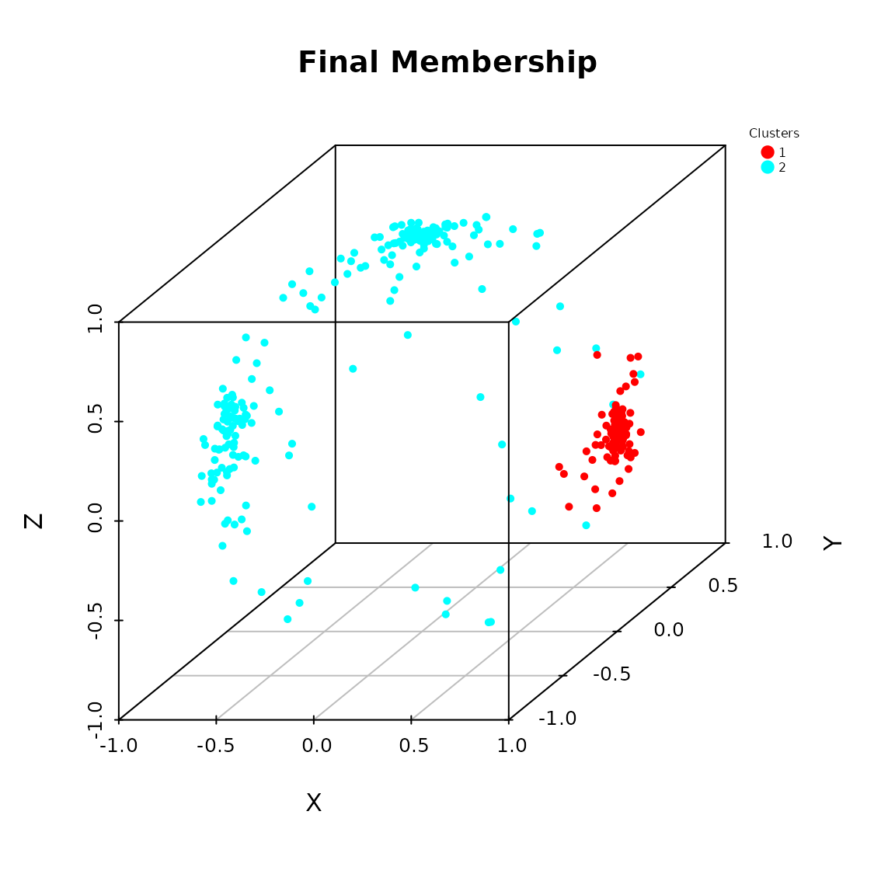
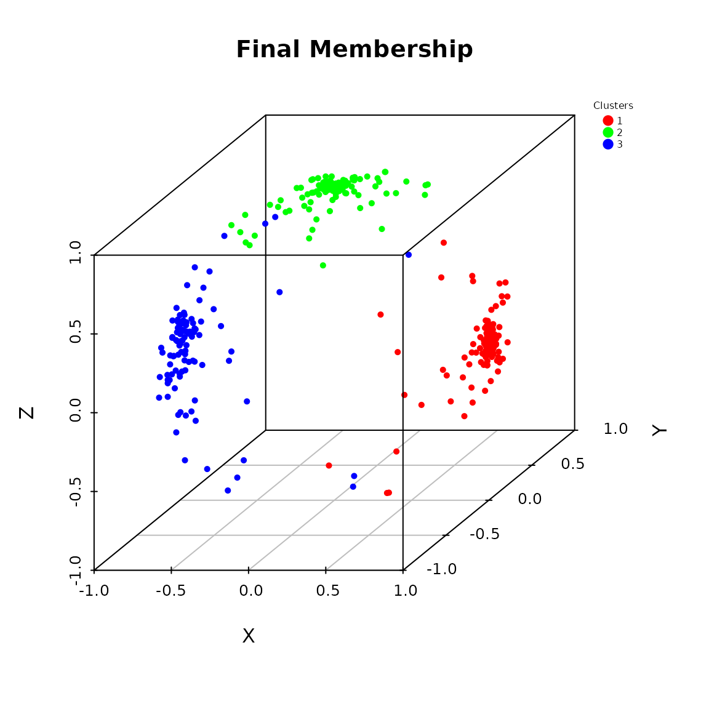
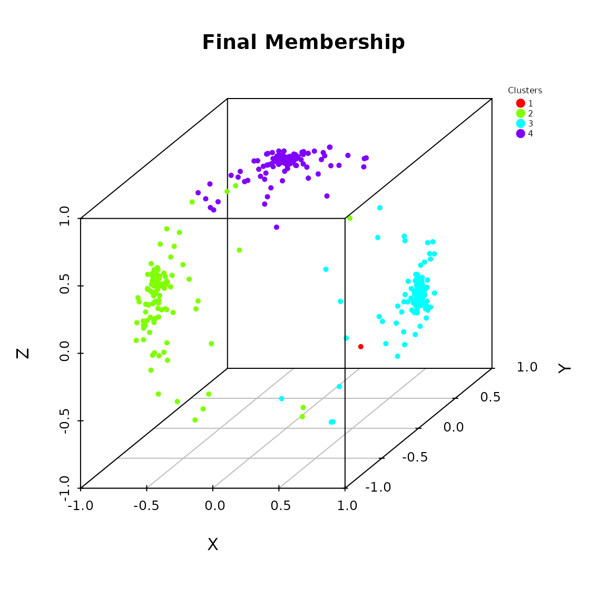
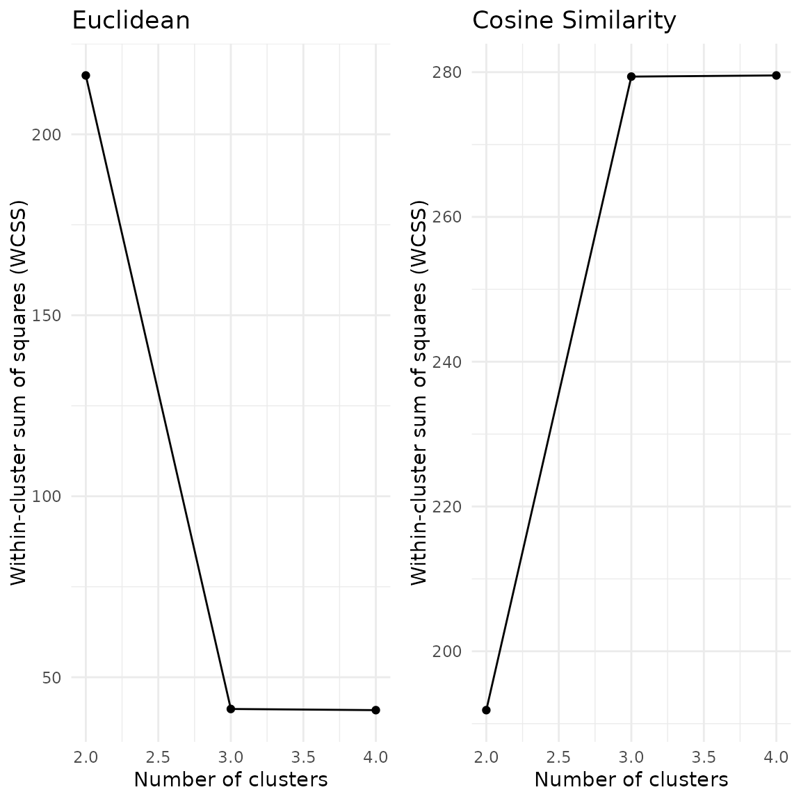

# Introduction to the QuadratiK Package

## Overview

The `QuadratiK` package provides the first implementation, in R and
Python, of a comprehensive set of goodness-of-fit tests and a clustering
technique for spherical data using kernel-based quadratic distances. The
primary goal of `QuadratiK` is to offer flexible tools for testing
multivariate and high-dimensional data for uniformity, normality,
comparing two or more samples.

This package includes several novel algorithms that are designed to
handle spherical data, which is often encountered in fields like
directional statistics, geospatial data analysis, and signal processing.
In particular, it offers functions for clustering spherical data
efficiently, for computing the density value and for generating random
samples from a Poisson kernel-based density.

### Installation

You can install the version published on CRAN of `QuadratiK`:

``` r

install.packages("QuadratiK")
```

Or the development version on GitHub:

``` r

library(devtools)
install_github('ropensci/QuadratiK')
# or via the rOpenSci organization repository
install.packages("QuadratiK", repos = "https://ropensci.r-universe.dev")
```

The `QuadratiK` package is also available in Python on PyPI and as a
Dashboard application. Usage instruction for the Dashboard can be found
at
<https://quadratik.readthedocs.io/en/latest/user_guide/dashboard_application_usage.html>.

### Citation

If you use this package in your research or work, please cite it as
follows:

Saraceno G, Markatou M, Mukhopadhyay R, Golzy M (2024). QuadratiK: A
Collection of Methods Constructed using Kernel-Based Quadratic
Distances. <https://cran.r-project.org/package=QuadratiK>

``` bibtex
@Manual{saraceno2024QuadratiK, 
   title = {QuadratiK: Collection of Methods Constructed using Kernel-Based 
            Quadratic Distances}, 
   author = {Giovanni Saraceno and Marianthi Markatou and Raktim Mukhopadhyay 
            and Mojgan Golzy}, 
   year = {2024}, 
   note = {<https://cran.r-project.org/package=QuadratiK>,
            <https://github.com/ropensci/QuadratiK>,
            <https://docs.ropensci.org/QuadratiK/>} 
}
```

and the associated paper:

Saraceno Giovanni, Markatou Marianthi, Mukhopadhyay Raktim, Golzy Mojgan
(2024). Goodness-of-Fit and Clustering of Spherical Data: the QuadratiK
package in R and Python. arXiv preprint arXiv:2402.02290.

``` bibtex
@misc{saraceno2024package, 
   title={Goodness-of-Fit and Clustering of Spherical Data: the QuadratiK package in
          R and Python}, 
   author={Giovanni Saraceno and Marianthi Markatou and Raktim Mukhopadhyay and
           Mojgan Golzy}, 
   year={2024}, 
   eprint={2402.02290}, 
   archivePrefix={arXiv}, 
   primaryClass={stat.CO},    
   url={<https://arxiv.org/abs/2402.02290>}
}
```

## Key features and basic usage

### Goodness-of-Fit Tests

``` r

library(QuadratiK)
```

The software implements one, two, and *k*-sample tests for goodness of
fit, offering an efficient and mathematically sound way to assess the
fit of probability distributions. Our tests are particularly useful for
large, high dimensional data sets where the assessment of fit of
probability models is of interest.

The provided goodness-of-fit tests can be performed using the
[`kb.test()`](https://docs.ropensci.org/QuadratiK/reference/kb.test.md)
function. The kernel-based quadratic distance tests are constructed
using the normal kernel which depends on the tuning parameter $`h`$. If
a value for $`h`$ is not provided, the function perform the
[`select_h()`](https://docs.ropensci.org/QuadratiK/reference/select_h.md)
algorithm searching for an optimal value. For more details please visit
the relative help documentations.

``` r

?kb.test
?select_h
```

The proposed tests perform well in terms of level and power for
contiguous alternatives, heavy tailed distributions and in higher
dimensions.

**Test for normality**

To test the null hypothesis of normality
$`H_0:F=\mathcal{N}_d(\mu, \Sigma)`$, we specify the mean vector `mu`
and the covariance matrix `Sigma`.

``` r

x <- matrix(rnorm(100), ncol = 2)
# Does x come from a multivariate standard normal distribution?
kb.test(x, h = 0.4, mu = c(0,0), Sigma = diag(2))
```

    ## 
    ##  Kernel-based quadratic distance Normality test 
    ## Statistics         U-statistic  V-statistic 
    ## --------------------------------------------
    ## Test Statistic:    1.454612     1.265573    
    ## Critical Value:    1.421826     8.901682    
    ## H0 is rejected:    TRUE         FALSE       
    ## Selected tuning parameter h:  0.4

The arguments `mu` and `Sigma` are mandatory for the normality test.

``` r

x <- matrix(rnorm(100,4), ncol = 2)
# Does x come from the specified multivariate normal distribution?
kb.test(x, mu = c(4,4), Sigma = diag(2), h = 0.4)
```

    ## 
    ##  Kernel-based quadratic distance Normality test 
    ## Statistics         U-statistic  V-statistic 
    ## --------------------------------------------
    ## Test Statistic:    -0.7819467   0.73944     
    ## Critical Value:    1.995888     8.901682    
    ## H0 is rejected:    FALSE        FALSE       
    ## Selected tuning parameter h:  0.4

**Two-sample test**

In case we want to compare two samples $`X \sim F`$ and $`Y \sim G`$
with the null hypothesis $`H_0:F=G`$ vs $`H_1:F\not =G`$.

``` r

x <- matrix(rnorm(100), ncol = 2)
y <- matrix(rnorm(100,mean = 5), ncol = 2)
# Do x and y come from the same distribution?
kb.test(x, y, h = 0.4)
```

    ## 
    ##  Kernel-based quadratic distance two-sample test 
    ## Statistics         Dn           Trace       
    ## --------------------------------------------
    ## Test Statistic:    5.786863     11.3252     
    ## Critical Value:    0.6396668    1.253269    
    ## H0 is rejected:    TRUE         TRUE        
    ## CV method:  subsampling 
    ## Selected tuning parameter h:  0.4

**k-sample test**

In case we want to compare $`k`$ samples, with $`k>2`$, that is
$`H_0:F_1=F_2=\ldots=F_k`$ vs $`H_1:F_i\not =F_j`$ for some
$`i\not = j`$.

``` r

x1 <- matrix(rnorm(100), ncol = 2)
x2 <- matrix(rnorm(100), ncol = 2)
x3 <- matrix(rnorm(100, mean = 5), ncol = 2)
y <- rep(c(1, 2, 3), each = 50)
# Do x1, x2 and x3 come from the same distribution?
x <- rbind(x1, x2, x3)
kb.test(x, y, h = 0.4)
```

    ## 
    ##  Kernel-based quadratic distance k-sample test 
    ## Statistics         Dn           Trace       
    ## --------------------------------------------
    ## Test Statistic:    7.729291     11.78748    
    ## Critical Value:    0.716388     1.093336    
    ## H0 is rejected:    TRUE         TRUE        
    ## CV method:  subsampling 
    ## Selected tuning parameter h:  0.4

#### Test for uniformity on the sphere

Expanded capabilities include supporting tests for uniformity on the
*(d-1)*-dimensional Sphere based on Poisson kernel. The Poisson kernel
depends on the concentration parameter $`\rho`$ and a location vector
$`\mu`$. For more details please visit the help documentation of the
[`pk.test()`](https://docs.ropensci.org/QuadratiK/reference/pk.test.md)
function.

``` r

?pk.test
```

To test the null hypothesis of uniformity on the $`(d-1)`$-dimensional
sphere $`\mathcal{S}^{d-1} = \{x \in \mathbb{R}^d : ||x||=1 \}`$

``` r

# Generate points on the sphere from the uniform ditribution 
x <- sample_hypersphere(d = 3, n_points = 100)
# Does x come from the uniform distribution on the sphere?
pk.test(x, rho = 0.7)
```

    ## 
    ##  Poisson Kernel-based quadratic distance test of 
    ##                         Uniformity on the Sphere 
    ## Selected concentration parameter rho:  0.7 
    ## 
    ## Tn-statistic:
    ## 
    ## H0 is rejected:  FALSE 
    ## Statistic Tn:  -0.5509718 
    ## Critical value:  1.799643 
    ## 
    ## Sn-statistic:
    ## 
    ## H0 is rejected:  FALSE 
    ## Statistic Sn:  16.20301 
    ## Critical value:  23.22949

### Poisson kernel-based distribution (PKBD)

The package offers functions for computing the density value and for
generating random samples from a PKBD. The Poisson kernel-based
densities are based on the normalized Poisson kernel and are defined on
the $`(d-1)`$-dimensional unit sphere. For more details please visit the
help documentation of the
[`dpkb()`](https://docs.ropensci.org/QuadratiK/reference/dpkb.md) and
[`rpkb()`](https://docs.ropensci.org/QuadratiK/reference/dpkb.md)
functions.

``` r

?dpkb
?rpkb
```

*Example*

``` r

mu <- c(1,0,0)
rho <- 0.9
x <- rpkb(n = 100, mu = mu, rho = rho)
head(x)
```

    ##            [,1]        [,2]        [,3]
    ## [1,]  0.9976763  0.05682801 -0.03758542
    ## [2,]  0.9904770 -0.04495342  0.13013249
    ## [3,]  0.9888587  0.07505889 -0.12854798
    ## [4,]  0.9950070  0.06974024  0.07139580
    ## [5,] -0.1933329 -0.94731344 -0.25538132
    ## [6,]  0.8946467  0.42830327  0.12713608

``` r

dens_x <- dpkb(x, mu = mu, rho = rho)
head(dens_x)
```

    ##             [,1]
    ## [1,] 8.951661143
    ## [2,] 3.381397108
    ## [3,] 2.901910102
    ## [4,] 5.778907486
    ## [5,] 0.004769433
    ## [6,] 0.169506227

### Clustering Algorithm for Spherical Data

The package incorporates a unique clustering algorithm specifically
tailored for spherical data and it is especially useful in the presence
of noise in the data and the presence of non-negligible overlap between
clusters. This algorithm leverages a mixture of Poisson kernel-based
densities on the Sphere, enabling effective clustering of spherical data
or data that has been spherically transformed. For more details please
visit the help documentation of the
[`pkbc()`](https://docs.ropensci.org/QuadratiK/reference/pkbc.md)
function.

``` r

?pkbc
```

*Example*

``` r

# Generate 3 samples from the PKBD with different location directions
x1 <- rpkb(n = 100, mu = c(1,0,0), rho = rho)
x2 <- rpkb(n = 100, mu = c(-1,0,0), rho = rho)
x3 <- rpkb(n = 100, mu = c(0,0,1), rho = rho)
x <- rbind(x1, x2, x3)
# Perform the clustering algorithm
# Serch for 2, 3 or 4 clusters
cluster_res <- pkbc(dat = x, nClust = c(2, 3, 4))
summary(cluster_res)
```

    ## Poisson Kernel-Based Clustering on the Sphere (pkbc) Results
    ## ------------------------------------------------------------
    ## 
    ## Summary:
    ##      nClust    LogLik     WCSS
    ## [1,]      2 -590.6534 408.1308
    ## [2,]      3 -295.4464 320.6149
    ## [3,]      4 -286.3995 320.4550
    ## 
    ## Results for 2 clusters:
    ## Estimated Mixing Proportions (alpha):
    ## [1] 0.2983261 0.7016739
    ## 
    ## Clustering table:
    ## 
    ##   1   2 
    ##  89 211 
    ## 
    ## 
    ## Results for 3 clusters:
    ## Estimated Mixing Proportions (alpha):
    ## [1] 0.3370865 0.3341407 0.3287728
    ## 
    ## Clustering table:
    ## 
    ##   1   2   3 
    ## 103  97 100 
    ## 
    ## 
    ## Results for 4 clusters:
    ## Estimated Mixing Proportions (alpha):
    ## [1] 0.003381178 0.328858098 0.333561205 0.334199519
    ## 
    ## Clustering table:
    ## 
    ##   1   2   3   4 
    ##   1 100 102  97

The software includes additional graphical functions, aiding users in
validating and representing the cluster results as well as enhancing the
interpretability and usability of the analysis.

``` r

# Predict the membership of new data with respect to the clustering results
x_new <- rpkb(n = 10, mu = c(1,0,0), rho = rho)
memb_mew <- predict(cluster_res, k = 3, newdata = x_new)
memb_mew$Memb
```

    ##  [1] 1 1 1 1 1 1 1 1 1 1

``` r

# Compute measures for evaluating the clustering results
val_res <- pkbc_validation(cluster_res)
val_res
```

    ## $metrics
    ##             2        3         4
    ## ASW 0.4980303 0.704625 0.5818335
    ## 
    ## $IGP
    ## $IGP[[1]]
    ## NULL
    ## 
    ## $IGP[[2]]
    ## [1] 0.9908257 1.0000000
    ## 
    ## $IGP[[3]]
    ## [1] 1 1 1
    ## 
    ## $IGP[[4]]
    ## [1] 1 1 1 1

``` r

# Plot method for the pkbc object:
# - scatter plot of data points on the sphere
# - elbow plot for helping the choice of the number of clusters
plot(cluster_res)
```



## Additional Resources

For more detailed information about the `QuadratiK` package, you can
explore the following resources:

- [Package Documentation on
  CRAN](https://CRAN.R-project.org/package=QuadratiK) – Official package
  documentation on CRAN.
- [GitHub Repository](https://github.com/ropensci/QuadratiK) – The
  GitHub repository with the development version, issues, and community
  discussions.
- [QuadratiK Package Website](https://docs.ropensci.org/QuadratiK/) – A
  dedicated website with additional tutorials and examples.

If you’re new to the package, we recommend starting with the available
vignettes:

- [Two-sample
  test](https://docs.ropensci.org/QuadratiK/articles/TwoSample_test.html)
- [k-sample
  test](https://docs.ropensci.org/QuadratiK/articles/kSample_test.html)
- [Test for
  uniformity](https://docs.ropensci.org/QuadratiK/articles/uniformity.html)
- [Clustering on the
  sphere](https://docs.ropensci.org/QuadratiK/articles/wireless_clustering.html)
- [Generate from
  PKBD](https://docs.ropensci.org/QuadratiK/articles/generate_rpkb.html)

### References

For more information on the methods implemented in this package, refer
to the associated research papers:

- Markatou, M. and Saraceno, G. (2024). “A Unified Framework for
  Multivariate Two- and k-Sample Kernel-based Quadratic Distance
  Goodness-of-Fit Tests.”
  [arXiv:2407.16374](https://doi.org/10.48550/arXiv.2407.16374)

- Ding, Y., Markatou, M. and Saraceno, G. (2023). “Poisson Kernel-Based
  Tests for Uniformity on the d-Dimensional Sphere.” Statistica Sinica.
  doi: [10.5705/ss.202022.0347](https://doi.org/10.5705/ss.202022.0347).

- Golzy, M. and Markatou, M. (2020) Poisson Kernel-Based Clustering on
  the Sphere: Convergence Properties, Identifiability, and a Method of
  Sampling, Journal of Computational and Graphical Statistics, 29:4,
  758-770, DOI:
  [10.1080/10618600.2020.1740713](https://doi.org/10.1080/10618600.2020.1740713).
