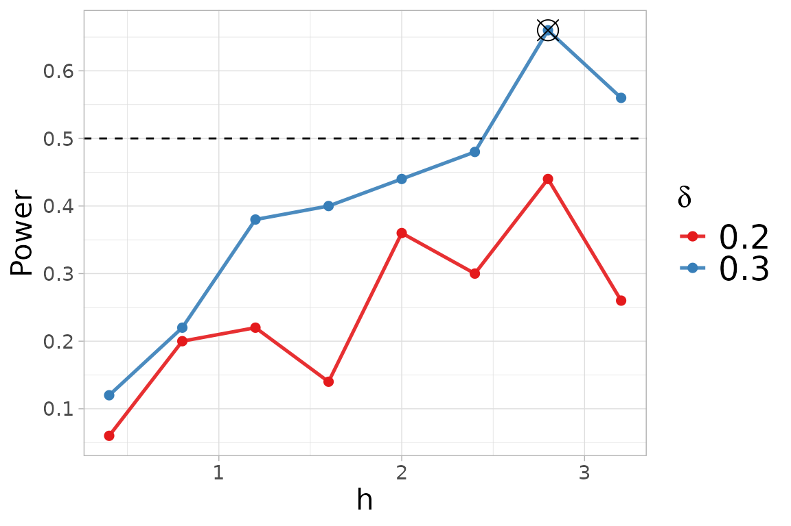
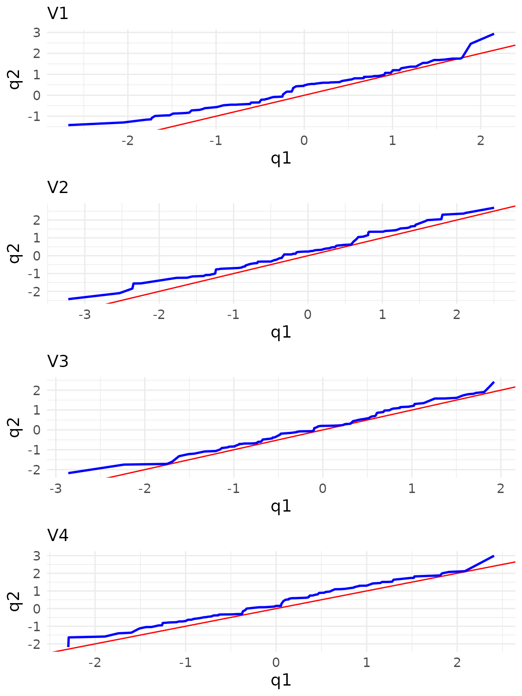

# Non-parametric Two-sample test

### Non-parametric two-sample test

Let $`x_1, x_2, \ldots, x_{n_1} \sim F`$ and
$`y_1, y_2, \ldots, y_{n_2} \sim G`$ be random samples from the
distributions $`F`$ and $`G`$, respectively. We test the null hypothesis
that the two samples are generated from the same *unknown* distribution
$`\bar{F}`$, that is:

``` math
H_0: F = G = \bar{F}
```

versus the alternative hypothesis that the two distributions are
different, that is

``` math
H_1: F \not = G.
```
We compute the kernel-based quadratic distance (KBQD) tests

``` math
    \mathrm{trace}_n =  \frac{1}{n_1(n_1-1)}\sum_{i=1}^{n_1} \sum_{j \not=i}^{n_1} K_{\bar{F}}(\mathbf{x}_i,\mathbf{x}_j) + \frac{1}{n_2(n_2-1)}\sum_{i=1}^{n_2} \sum_{j \not=i}^{n_2} K_{\bar{F}}(\mathbf{y}_i,\mathbf{y}_j),
```
and
``` math
    D_{n} =  \frac{1}{n_1(n_1-1)}\sum_{i=1}^{n_1} \sum_{j \not=i}^{n_2} K_{\bar{F}}(\mathbf{x}_i,\mathbf{x}_j) - \frac{2}{n_1 n_2}\sum_{i=1}^{n_1} \sum_{j =1}^{n_2} K_{\bar{F}}(\mathbf{x}_i,\mathbf{y}_j) 
     + \frac{1}{n_2(n_2-1)}\sum_{i=1}^{n_2} \sum_{j \not=i}^{n_2} K_{\bar{F}}(\mathbf{y}_i,\mathbf{y}_j).  \nonumber
```
where $`K_{\bar{F}}`$ denotes the Normal kernel $`K`$ defined as

``` math
K(\mathbf{s}, \mathbf{t}) = (2 \pi)^{-d/2} 
\left(\det{\mathbf{\Sigma}_h}\right)^{-\frac{1}{2}}  
\exp\left\{-\frac{1}{2}(\mathbf{s} - \mathbf{t})^\top 
\mathbf{\Sigma}_h^{-1}(\mathbf{s} - \mathbf{t})\right\},
```

for every $`\mathbf{s}, \mathbf{t} \in \mathbb{R}^d \times
\mathbb{R}^d`$, with covariance matrix $`\mathbf{\Sigma}_h = h^2 I`$ and
tuning parameter $`h`$, centered with respect to
$`\bar{F} = \frac{n_1F + n_2G}{n_1 + n_2}`$. For more information about
the centering of the kernel, see the documentation of the
[`kb.test()`](https://docs.ropensci.org/QuadratiK/reference/kb.test.md)
function.

``` r

help(kb.test) 
```

The KBQD tests exhibit high power against asymmetric alternatives that
are close to the null hypothesis and with small sample size. We consider
an example of this scenario. We generate the samples
$`x = (x_1, \ldots,x_n)`$ from a standard normal distribution
$`N_d(0,I_d)`$ and $`y = (y_1, \ldots,y_n)`$ from a skew-normal
distribution $`SN_d(0,I_d, \lambda)`$, where $`d=4`$, $`n=100`$ and
$`\lambda= (0.5,\ldots,0.5)`$.

``` r

library(sn)
library(mvtnorm)
library(QuadratiK)
n <- 100
d <- 4
skewness_y <- 0.5
set.seed(2468)
x_2 <- rmvnorm(n, mean = rep(0, d))
y_2 <- rmsn(n = n, xi = 0, Omega = diag(d), alpha = rep(skewness_y, d))
```

The two-sample test can be performed by providing the two samples to be
compared as `x` and `y` to the
[`kb.test()`](https://docs.ropensci.org/QuadratiK/reference/kb.test.md)
function. If a value of $`h`$ is not provided, the function
automatically performs the function `select_h`.

``` r

set.seed(2468)
two_test <- kb.test(x = x_2, y = y_2)
two_test
```

    ## 
    ##  Kernel-based quadratic distance two-sample test 
    ## Statistics         Dn           Trace       
    ## --------------------------------------------
    ## Test Statistic:    1.807311     2.697168    
    ## Critical Value:    0.9535013    1.423767    
    ## H0 is rejected:    TRUE         TRUE        
    ## CV method:  subsampling 
    ## Selected tuning parameter h:  2.8

We can display the chosen *optimal* value of $`h`$ together with the
power plot obtained versus the considered $`h`$, for the alternatives
$`\delta`$ in the
[`select_h()`](https://docs.ropensci.org/QuadratiK/reference/select_h.md)
function.

``` r

two_test@h$h_sel
```

    ## [1] 2.8

``` r

two_test@h$power.plot
```



For more details visit the help documentation of the
[`select_h()`](https://docs.ropensci.org/QuadratiK/reference/select_h.md)
function.

``` r

help(select_h) 
```

For the two-sample case, the `summary` function provides the results
from the test and a list tables of the standard descriptive statistics
for each variable, computed per group and overall. Additionally, it
generates the qq-plots comparing the quantiles of the two groups for
each variable.

``` r

summary_two <- summary(two_test)
```



    ## 
    ##  Kernel-based quadratic distance two-sample test 
    ##   Statistic    Value Critical_Value Reject_H0
    ## 1        Dn 1.807311      0.9535013      TRUE
    ## 2     Trace 2.697168      1.4237668      TRUE

``` r

summary_two$summary_tables
```

    ## [[1]]
    ##             Group 1    Group 2    Overall
    ## mean   -0.005393522  0.3197861  0.1571963
    ## sd      1.039119207  0.9094193  0.9875137
    ## median -0.019317321  0.4448058  0.1601955
    ## IQR     1.562613453  1.3612937  1.4292426
    ## min    -2.675477796 -1.4256211 -2.6754778
    ## max     2.151784802  2.9375947  2.9375947
    ## 
    ## [[2]]
    ##            Group 1    Group 2     Overall
    ## mean   -0.10005083  0.1936138  0.04678149
    ## sd      1.10476260  1.0556439  1.08777010
    ## median -0.07955849  0.2235325  0.10130247
    ## IQR     1.48816630  1.4716179  1.41498342
    ## min    -3.22222061 -2.4336333 -3.22222061
    ## max     2.50192633  2.6879362  2.68793623
    ## 
    ## [[3]]
    ##             Group 1    Group 2     Overall
    ## mean   -0.006524772  0.1701261  0.08180065
    ## sd      0.958942739  0.9524916  0.95742170
    ## median -0.039301279  0.1887394  0.11877637
    ## IQR     1.329868172  1.4657107  1.40312077
    ## min    -2.860006689 -2.1762183 -2.86000669
    ## max     1.923763114  2.4237195  2.42371949
    ## 
    ## [[4]]
    ##            Group 1    Group 2     Overall
    ## mean   -0.06757686  0.2236458  0.07803449
    ## sd      0.98684958  0.9862135  0.99481815
    ## median -0.03258747  0.1097711  0.05517931
    ## IQR     1.30933016  1.4088334  1.39890664
    ## min    -2.29625537 -2.1827156 -2.29625537
    ## max     2.40795077  2.9929942  2.99299420

#### Select h

The search for the *optimal* value of the tuning parameter $`h`$ can be
performed independently from the test computation using the `select_h`
function. It requires the two samples, provided as `x` and `y`, and the
considered family of alternatives.

``` r

set.seed(2468)
two_test_h <- select_h(x = x_2, y = y_2, alternative = "skewness")
```

The code is not evaluated since we would obtain the same results.

#### Note

Notice that the test statistics for two-sample testing coincide with the
$`k`$-sample test statistics when $`k=2`$. Hence, alternatively the two
sample tests can be performed providing the two samples together as `x`
and indicating the membership to the groups with the argument `y`.

``` r

x_pool <- rbind(x_2, y_2)
y_memb <- rep(c(1, 2), each = n)
h <- two_test@h$h_sel
set.seed(2468)
kb.test(x = x_pool, y = y_memb, h = h)
```

    ## 
    ##  Kernel-based quadratic distance k-sample test 
    ## Statistics         Dn           Trace       
    ## --------------------------------------------
    ## Test Statistic:    1.807311     2.697168    
    ## Critical Value:    0.9535013    1.423767    
    ## H0 is rejected:    TRUE         TRUE        
    ## CV method:  subsampling 
    ## Selected tuning parameter h:  2.8

See the *k-sample test* vignette for more details.

In the
[`kb.test()`](https://docs.ropensci.org/QuadratiK/reference/kb.test.md)
function, the critical value can be computed with the subsampling,
bootstrap or permutation algorithm. The default method is set to
subsampling since it needs less computational time. For details on the
sampling algorithm see the documentation of the
[`kb.test()`](https://docs.ropensci.org/QuadratiK/reference/kb.test.md)
function.

For more details on the level and power performance of the considered
two-sample tests, see the extensive simulation study reported in the
following reference.

## References

Markatou, M. and Saraceno, G. (2024). “A Unified Framework for
Multivariate Two- and k-Sample Kernel-based Quadratic Distance
Goodness-of-Fit Tests.”  
<https://doi.org/10.48550/arXiv.2407.16374>
