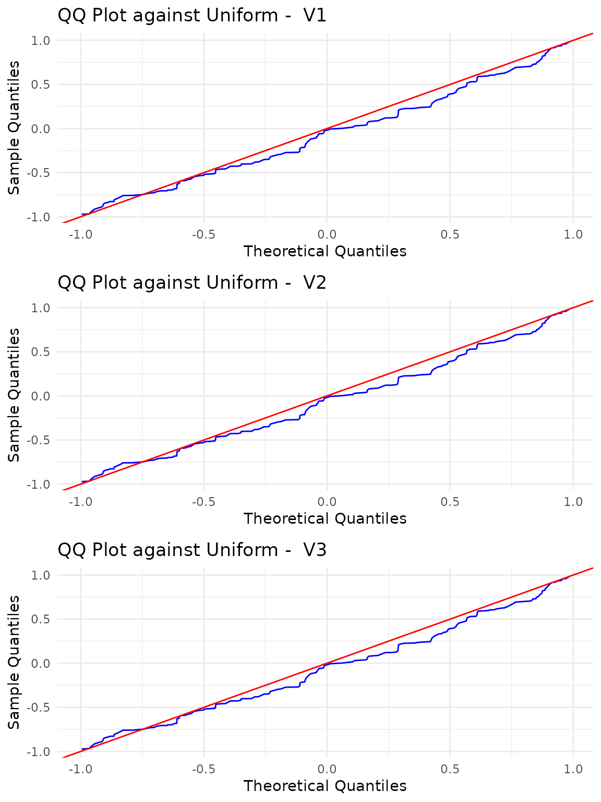

# Uniformity test on the Sphere

### Uniformity test on the Sphere

Let $`x_1, x_2, \ldots, x_n \sim F`$ be a random sample with empirical
distribution function $`\hat{F}`$. We test the null hypothesis of
uniformity on the $`d`$-dimensional sphere, i.e., $`H_0: F = G`$ where
$`G`$ is the uniform distribution on the $`d`$-dimensional sphere
$`\mathcal{S}^{d-1}`$.

We compute the U-statistic estimate of the sample KBQD (Kernel-Based
Quadratic Distance)
``` math
U_{n}=\frac{2}{n(n-1)}\sum_{i=2}^{n}\sum_{j=1}^{i-1}K_{cen}(\mathbf{x}_{i}, \mathbf{x}_{j}),
```
then the first test statistic is given as
``` math
T_{n}=\frac{U_{n}}{\sqrt{Var(U_{n})}},
```
with
``` math
Var(U_{n})= \frac{2}{n(n-1)}\left[\frac{1+\rho^{2}}{(1-\rho^{2})^{d-1}}-1\right],
```

and the V-statistic estimate of the KBQD  
``` math
S_{n} = \frac{1}{n}\sum_{i=1}^{n}\sum_{j=1}^{n}K_{cen}(\mathbf{x}_{i}, \mathbf{x}_{j}),
```
where $`K_{cen}`$ denotes the Poisson kernel $`K_\rho`$ centered with
respect to the uniform distribution on the $`d`$-dimensional sphere,
that is
``` math
K_{cen}(\mathbf{u}, \mathbf{v}) = K_\rho(\mathbf{u}, \mathbf{v}) -1 
```
and
``` math
K_\rho(\mathbf{u}, \mathbf{v}) = \frac{1-\rho^{2}}{\left(1+\rho^{2}-2\rho
(\mathbf{u}\cdot \mathbf{v})\right)^{d/2}},
```

for every
$`\mathbf{u}, \mathbf{v} \in \mathcal{S}^{d-1} \times \mathcal{S}^{d-1}`$.

We generated $`n=200`$ observations from the uniform distribution on
$`S^{d-1}`$, with $`d=3`$.

``` r

library(QuadratiK)
n <- 200
d <- 3
set.seed(2468)
z <- matrix(rnorm(n * d), n, d)
dat_sphere <- z/sqrt(rowSums(z^2))
```

The `pk.test` is used for testing uniformity of the generated sample,
providing the data matrix as `x` and the value of the concentration
parameter `rho`.

``` r

rho <- 0.7
set.seed(2468)
res_unif <- pk.test(x = dat_sphere, rho = rho)

show(res_unif)
```

    ## 
    ##  Poisson Kernel-based quadratic distance test of 
    ##                         Uniformity on the Sphere 
    ## Selected concentration parameter rho:  0.7 
    ## 
    ## Tn-statistic:
    ## 
    ## H0 is rejected:  FALSE 
    ## Statistic Tn:  -0.9756673 
    ## Critical value:  1.725683 
    ## 
    ## Sn-statistic:
    ## 
    ## H0 is rejected:  FALSE 
    ## Statistic Sn:  14.89598 
    ## Critical value:  23.22949

The
[`pk.test()`](https://docs.ropensci.org/QuadratiK/reference/pk.test.md)
function returns an object of class `pk.test`. The `show` function
displays the computed statistics and the corresponding critical values.

The test correctly does not reject the null hypothesis of uniformity.

The `summary` function for the `pk.test` output object provides the
results of the performed test, and generates a figure showing the
qq-plots against the uniform distribution of each variable with a table
of standard descriptive statistics.

``` r

summary_unif <- summary(res_unif)
```

    ## 
    ##  Poisson Kernel-based quadratic distance test of 
    ##                         Uniformity on the Sphere 
    ##   Statistic      Value Critical_Value Reject_H0
    ## 1        Tn -0.9756673       1.725683     FALSE
    ## 2        Sn 14.8959834      23.229487     FALSE



The figure automatically generated by the `summary` function on the
result of the test for uniformity displays the qq-plots between the
given samples and the uniform distribution with a table of the standard
descriptive statistics for each variable.

#### Multimodal example

The Poisson kernel-based test for uniformity exhibits excellent results
especially in the case of multimodal distributions.

In this example, we generate data points from a mixture of 4 von
Mises-Fisher distributions in 2 dimensions. The direction of the mean
vectors for the distributions are set as (1, 0), (0, 1), (-1, 0), and
(0, -1), with a concentration parameter $`\kappa=5`$.

``` r

# Load necessary libraries
library(movMF)        
library(sphunif)      
```

``` r

set.seed(2468)
# Define the mean directions of the 4 von Mises-Fisher distributions
means <- rbind(
  c(1, 0),    
  c(0, 1),    
  c(-1, 0),   
  c(0, -1)    
)
# Define the concentration parameter (kappa)
kappa <- 5
# Generate 100 samples from a mixture of 4 von Mises-Fisher distributions
samples <- matrix(rmovMF(100, theta = kappa * means), ncol = 2)
```

We now compare the results of the `pk.test` function with the Ajne and
Bingham tests using the `sphunif` package.

``` r

# Run the pk.test from the QuadratiK package to test the data
pk_test_result <- pk.test(samples, rho = 0.8)

# Run the Bingham and Ajne tests from the sphunif package
other_test_result <- unif_test(samples, type = c("Bingham", "Ajne"))

pk_test_result
```

    ## 
    ##  Poisson Kernel-based quadratic distance test of 
    ##                         Uniformity on the Sphere 
    ## Selected concentration parameter rho:  0.8 
    ## 
    ## Tn-statistic:
    ## 
    ## H0 is rejected:  TRUE 
    ## Statistic Tn:  2.692594 
    ## Critical value:  1.612663 
    ## 
    ## Sn-statistic:
    ## 
    ## H0 is rejected:  TRUE 
    ## Statistic Sn:  15.14426 
    ## Critical value:  12.8308

``` r

other_test_result
```

    ## $Bingham
    ## 
    ##  Bingham test of circular uniformity
    ## 
    ## data:  samples
    ## statistic = 5.8674, p-value = 0.0532
    ## alternative hypothesis: scatter matrix different from constant
    ## 
    ## 
    ## $Ajne
    ## 
    ##  Ajne test of circular uniformity
    ## 
    ## data:  samples
    ## statistic = 0.28268, p-value = 0.3156
    ## alternative hypothesis: any non-axial alternative to circular uniformity

In this example, the Poisson kernel-based test statistics reject the
null hypothesis, while the Bingham test and Ajne test obtain p-values
equal to 0.0532 and 0.3156, respectively.

## References

Ding, Y., Markatou, M. and Saraceno, G. (2023). “Poisson Kernel-Based
Tests for Uniformity on the d-Dimensional Sphere.” *Statistica Sinica*.
[doi:10.5705/ss.202022.0347](https://doi.org/10.5705/ss.202022.0347).
