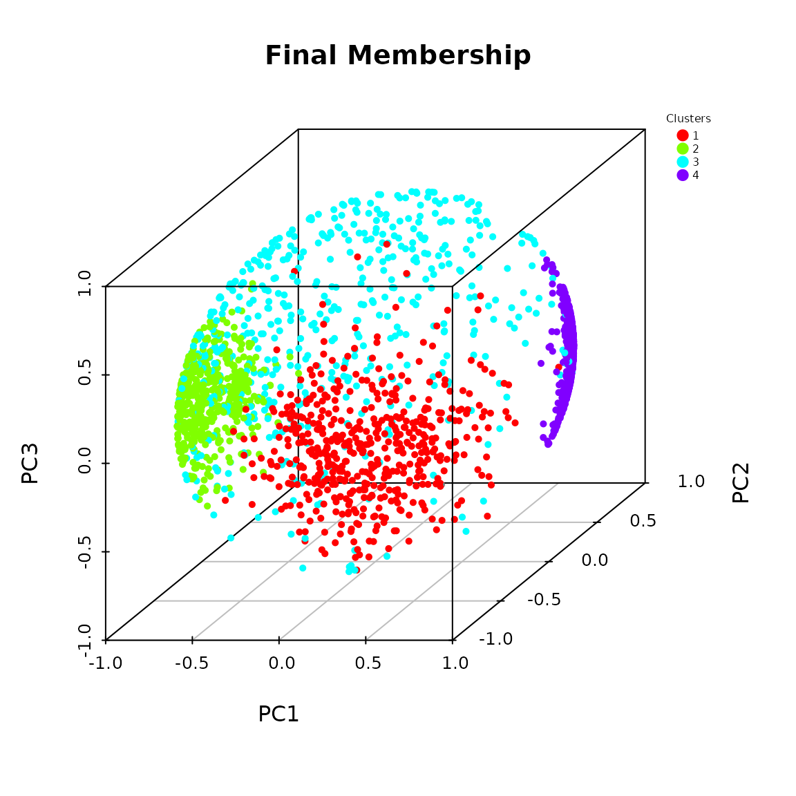
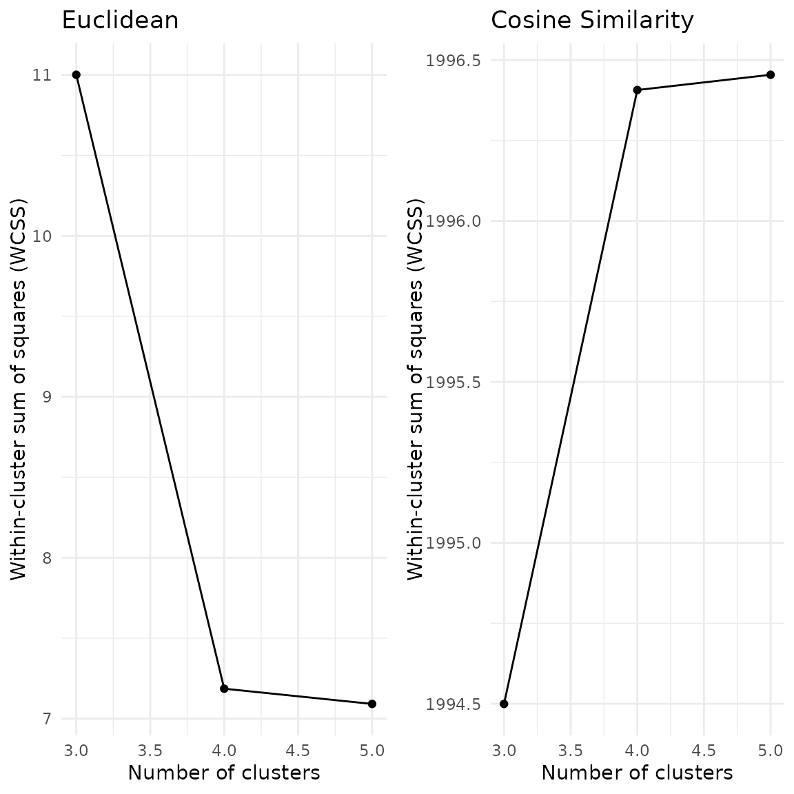
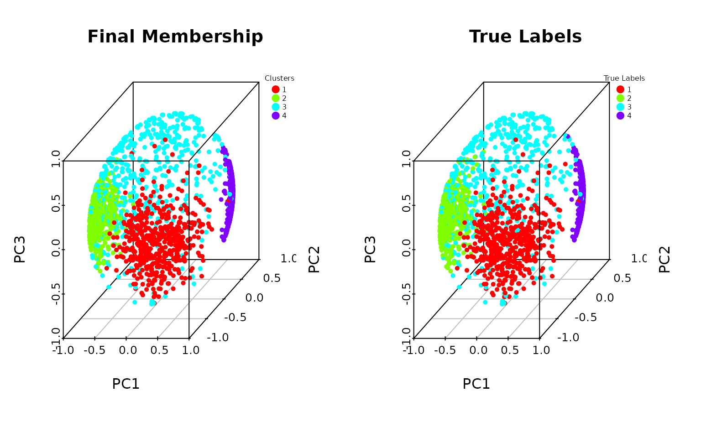
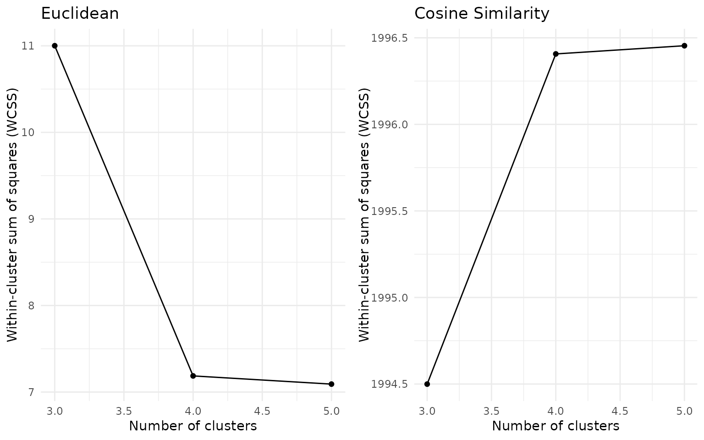

# Clustering algorithm on the Wireless data

### The Wireless Indoor Localization Data

We consider the Wireless Indoor Localization Data Set, publicly
available in the UCI Machine Learning Repository’s website. This data
set is used to study the performance of different indoor localization
algorithms. It is available within the `QuadratiK` package as
`wireless`.

``` r

library(QuadratiK)
head(wireless)
```

    ##    V1  V2  V3  V4  V5  V6  V7 V8
    ## 1 -64 -56 -61 -66 -71 -82 -81  1
    ## 2 -68 -57 -61 -65 -71 -85 -85  1
    ## 3 -63 -60 -60 -67 -76 -85 -84  1
    ## 4 -61 -60 -68 -62 -77 -90 -80  1
    ## 5 -63 -65 -60 -63 -77 -81 -87  1
    ## 6 -64 -55 -63 -66 -76 -88 -83  1

The Wireless Indoor Localization data set contains the measurements of
the Wi-Fi signal strength in different indoor rooms. It consists of a
data frame with 2000 rows and 8 columns. The first 7 variables report
the values of the Wi-Fi signal strength received from 7 different Wi-Fi
routers in an office location in Pittsburgh (USA). The last column
indicates the class labels, from 1 to 4, indicating the different rooms.
Notice that, the Wi-Fi signal strength is measured in dBm, decibel
milliwatts, which is expressed as a negative value ranging from -100 to
0. In total, we have 500 observations for each room.

In many wireless applications, the relative signal strengths across
routers are more relevant to the underlying spatial patterns and device
positioning than the absolute magnitudes. Additionally, absolute signal
strength can be affected by noise, device orientation or environmental
factors. In this case, it is reasonable to consider the spherically
transformed data points using L2 normalization. This transformation maps
the data onto the surface of a 6-dimensional sphere, ensuring that each
observation has a uniform length. Given that absolute signal strength is
not critical to the research question, the spherical representation
provides a meaningful and interpretable framework for studying the data
set. In general, it is appropriate to consider spherically transformed
data points when: (i) the absolute length of the measurements is
irrelevant or too noisy; (ii) if we are more interested in the relative
distributions (or angular relationships) between data points.

We perform the clustering algorithm on the `wireless` data set. We
consider the $`K= 3, 4, 5`$ as possible values for the number of
clusters.

``` r

wire <- wireless[,-8]
labels <- wireless[,8]
wire_norm <- wire/sqrt(rowSums(wire^2))
set.seed(2468)
res_pk <- pkbc(as.matrix(wire_norm), 3:5)
```

The `pkbc` function creates an object of class `pkbc` containing the
clustering results for each value of number of clusters considered.

To guide the choice of the number of clusters, the function
`pkbc_validation` provides cluster validation measures and graphical
tools. Specifically, it returns an object with InGroup Proportion (IGP),
and `metrics`, a table of computed evaluation measures. This table
includes the Average Silhouette Width (ASW) and, if the true labels are
provided, the measures of adjusted rand index (ARI), Macro-Precision and
Macro-Recall.

``` r

set.seed(2468)
res_validation <- pkbc_validation(res_pk, true_label = labels)
res_validation$IGP
```

    ## [[1]]
    ## NULL
    ## 
    ## [[2]]
    ## NULL
    ## 
    ## [[3]]
    ## [1] 0.9860558 0.9706215 0.9429038
    ## 
    ## [[4]]
    ## [1] 0.9662698 0.9733607 0.9526627 0.9880240
    ## 
    ## [[5]]
    ## [1] 0.9713701 0.7727273 0.9880240 0.9639831 0.9433498

``` r

round(res_validation$metrics, 5)
```

    ##                       3       4       5
    ## ASW             0.35326 0.38031 0.30240
    ## ARI             0.69526 0.94031 0.91409
    ## Macro_Precision 0.18389 0.97719 0.00120
    ## Macro_Recall    0.26000 0.97700 0.00150

The clusters identified with $`k=4`$ achieve high values of ARI, Macro
Precision and Macro Recall.

For a brief description of the reported evaluation measures, with the
corresponding references, please visit the help documentation of the
`pkbc_validation` function.

``` r

help(pkbc_validation)
```

The `plot` method of the `pkbc` class can be used to display the scatter
plot of data points and the Elbow plot from the computed within-cluster
sum of squares values. For the scatter plot, for $`d=2`$ and $`d=3`$,
observations are displayed on the unit circle and unit sphere,
respectively. If $`d>3`$, the spherical PCA is applied on the data set,
and the first 3 principal components are used for visualizing data
points on the sphere. In the generated scatter plot for the specified
number of clusters, data points are colored by the assigned membership.

``` r

plot(res_pk, k = 4)
```



The Elbow plots and the reported metrics suggest $`K=4`$ as number of
clusters. This is in accordance with the known ground truth.

Additionally, if true labels are available and are provided to the
`plot` method, the scatter plot will display the data points colored
with respect to the true labels and assigned memberships in two adjacent
plots.

``` r

plot(res_pk, k=4, true_label = labels)
```



The plot of points using the principal components also shows that the
identified cluster follows the initial labels.

Once the number of clusters is selected, the method `summary_stat` can
be used to obtain additional summary information with respect to the
clustering results. In particular, the function provides mean, standard
deviation, median, inter-quantile range, minimum and maximum computed
for each variable, overall and by the assigned membership.

``` r

summary_clust <- stats_clusters(res_pk, 4)
```

``` r

summary_clust
```

    ## [[1]]
    ##            Group 1     Group 2     Group 3     Group 4     Overall
    ## mean   -0.33976246 -0.23423419 -0.29470203 -0.34377323 -0.30363137
    ## sd      0.01283014  0.05324085  0.01581506  0.01298448  0.05251967
    ## median -0.33952107 -0.24604104 -0.29625176 -0.34242063 -0.31847692
    ## IQR     0.01674475  0.03014941  0.02182651  0.01835030  0.06412536
    ## min    -0.37455424 -0.30643954 -0.34994496 -0.39357081 -0.39357081
    ## max    -0.29339739 -0.06308050 -0.23847076 -0.31226867 -0.06308050
    ## 
    ## [[2]]
    ##            Group 1     Group 2     Group 3     Group 4     Overall
    ## mean   -0.30636324 -0.35918738 -0.32636022 -0.31540450 -0.32655905
    ## sd      0.01392354  0.02052666  0.01842337  0.01608549  0.02635941
    ## median -0.30600005 -0.35809184 -0.32487137 -0.31538238 -0.32221067
    ## IQR     0.01958541  0.02460137  0.02426854  0.02263003  0.03624468
    ## min    -0.35600342 -0.45578394 -0.40026324 -0.36631517 -0.45578394
    ## max    -0.26903743 -0.30605235 -0.27775661 -0.27586207 -0.26903743
    ## 
    ## [[3]]
    ##            Group 1     Group 2     Group 3     Group 4     Overall
    ## mean   -0.32905221 -0.35786158 -0.31417147 -0.28929074 -0.32231793
    ## sd      0.01563476  0.02459888  0.01710971  0.02094437  0.03163402
    ## median -0.32915518 -0.35575396 -0.31237754 -0.29072716 -0.32209343
    ## IQR     0.01957377  0.03437142  0.02422092  0.02851547  0.03973413
    ## min    -0.38248214 -0.43623816 -0.38676345 -0.33639128 -0.43623816
    ## max    -0.28256746 -0.28237524 -0.26460827 -0.23485570 -0.23485570
    ## 
    ## [[4]]
    ##            Group 1     Group 2     Group 3     Group 4     Overall
    ## mean   -0.34918727 -0.24111635 -0.30079691 -0.35013402 -0.31082318
    ## sd      0.01475930  0.04839750  0.01973759  0.01679759  0.05251032
    ## median -0.34858664 -0.24898566 -0.30107248 -0.35004522 -0.32519736
    ## IQR     0.01898212  0.03356955  0.02672633  0.02286452  0.06907237
    ## min    -0.40129910 -0.31690470 -0.35542814 -0.41273961 -0.41273961
    ## max    -0.30779911 -0.07399736 -0.23119131 -0.30906423 -0.07399736
    ## 
    ## [[5]]
    ##            Group 1     Group 2     Group 3     Group 4     Overall
    ## mean   -0.38226045 -0.43319403 -0.37583631 -0.28257085 -0.36807675
    ## sd      0.01770626  0.02787579  0.01814674  0.02110273  0.05820777
    ## median -0.37991233 -0.43009295 -0.37549563 -0.28337199 -0.37738801
    ## IQR     0.02531565  0.04108696  0.02541214  0.02710382  0.06966093
    ## min    -0.45385132 -0.52580164 -0.42808192 -0.34353824 -0.52580164
    ## max    -0.34027255 -0.36916034 -0.33333333 -0.21464345 -0.21464345
    ## 
    ## [[6]]
    ##            Group 1     Group 2     Group 3     Group 4     Overall
    ## mean   -0.45125600 -0.46327257 -0.48366352 -0.49713921 -0.47391075
    ## sd      0.01446455  0.02195263  0.01814601  0.01412842  0.02488735
    ## median -0.45081811 -0.46519225 -0.48319020 -0.49649227 -0.47411000
    ## IQR     0.01833254  0.02770315  0.02503768  0.01895624  0.03825696
    ## min    -0.51475369 -0.53938031 -0.53130759 -0.53840040 -0.53938031
    ## max    -0.41652096 -0.40313011 -0.44107352 -0.45551482 -0.40313011
    ## 
    ## [[7]]
    ##            Group 1     Group 2     Group 3     Group 4     Overall
    ## mean   -0.45728346 -0.46863418 -0.48984740 -0.49701329 -0.47827795
    ## sd      0.01710219  0.02396734  0.01993870  0.01587742  0.02515570
    ## median -0.45703017 -0.46920446 -0.49013407 -0.49711582 -0.47914650
    ## IQR     0.02311965  0.03050579  0.02784124  0.02030659  0.03643335
    ## min    -0.50728615 -0.56835661 -0.54571977 -0.53648350 -0.56835661
    ## max    -0.41326597 -0.38995633 -0.43815927 -0.44423198 -0.38995633

## Note

If the number of cluster *k* is not provided to the `plot` function, one
scatter plot is displayed for each possible number of clusters available
in the object of class `pkbc`.

## References

Golzy, M. and Markatou, M. (2020). “Poisson Kernel-Based Clustering on
the Sphere: Convergence Properties, Identifiability, and a Method of
Sampling,” *Journal of Computational and Graphical Statistics*, 29(4),
758-770. [DOI:
10.1080/10618600.2020.1740713](https://doi.org/10.1080/10618600.2020.1740713).
